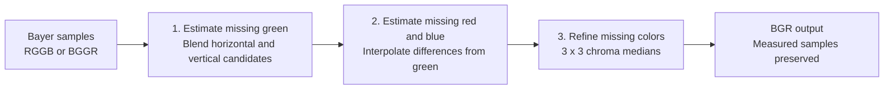
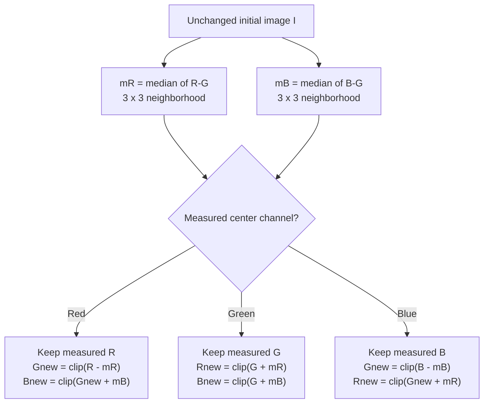
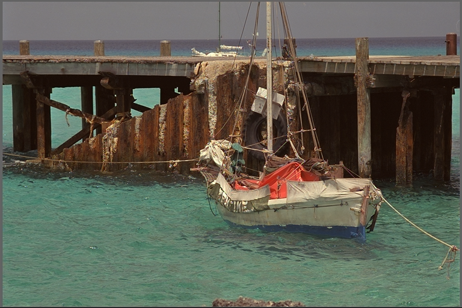

# SoftMenon

Fast 8-bit Bayer demosaicing on CPU and CUDA, with C/C++ and Rust interfaces.
Supports **RGGB and BGGR → BGR**, including odd image sizes and strided rows.
Forked from [libdebayer](https://github.com/catid/libdebayer); existing library
and API names are retained.

## Algorithms

- **Bilinear** — simple local interpolation.
- **Malvar 2004** — fixed cross-channel correction filters.
- **Menon 2007** — full paper DDFAPD, including refinement.
- **SoftMenon** — soft green decisions followed by a 3×3 chroma-median
  refinement of missing green and red/blue, preserving every measured sample.

SoftMenon scores **0.564 dB above full paper Menon** on our 442-image benchmark.
It improves mean quality on all five datasets versus paper Menon, with wins on 377/442
scenes; some scenes still favor Menon. [benchmarks.md](benchmarks.md) reports
the evaluation protocol, regressions, raw results, and reproduction instructions.

## How SoftMenon works

Each Bayer pixel measures just one of red, green, or blue. SoftMenon fills the
two missing channels in three stages. The diagrams use logical RGB names;
the library writes interleaved **BGR**. Full paper Menon remains a separate
algorithm and benchmark baseline.



**1. Soft directional green.** At each measured red or blue pixel, estimate
green horizontally and vertically. Each candidate averages the two adjacent
green samples and adds a correction from the measured center color and its
same-color neighbors two pixels away. Let `C0` be the measured red or blue
center value; `GL, GR, GU, GD` are measured green one pixel left, right, up,
and down. `CL2, CR2, CU2, CD2` are samples of the center's color two pixels
away in those directions.

`Gh` and `Gv` are the horizontal and vertical green candidates. `Sh` and `Sv`
score their consistency with neighboring color/green pairs:

```text
Gh = round((GL + GR)/2) + round((2*C0 - CL2 - CR2)/4)
Gv = round((GU + GD)/2) + round((2*C0 - CU2 - CD2)/4)

Sh = abs((C0 - Gh) - (CL2 - GL)) + abs((C0 - Gh) - (CR2 - GR))
Sv = abs((C0 - Gv) - (CU2 - GU)) + abs((C0 - Gv) - (CD2 - GD))
```

Each `round` rounds to the nearest integer, with half ties toward positive
infinity; the two terms in each candidate are rounded separately. Lower scores
receive more weight, so `Sv + 1` weights `Gh` and `Sh + 1` weights `Gv`:

```text
G = clip(round(((Sv + 1)*Gh + (Sh + 1)*Gv) / (Sh + Sv + 2)))
```

This blend changes smoothly as the scores change. Measured green pixels pass
through unchanged. Here is the sampling footprint around a measured red pixel;
swap R and B for a measured blue pixel:

```text
 .   .   R   .   .
 .   .   G   .   .
 R   G  [R]  G   R
 .   .   G   .   .
 .   .   R   .   .

Horizontal candidate: left/right G plus horizontal R correction
Vertical candidate:   up/down G plus vertical R correction
```

**2. Initial color reconstruction.** With green available at every pixel,
estimate missing red and blue through their differences from green. For a
target color `C` (red or blue), each measured-color neighbor contributes
`D = C - G`, using the green estimate at that same neighbor. Interpolate `D`,
then add the center green `G0`:


At a **measured-green pixel**, red neighbors lie along one axis and blue
neighbors along the other. For this Bayer position:

```text
          B_up
 R_left  [G0]  R_right
         B_down

R = clip(G0 + round(((R_left - G_left) + (R_right - G_right))/2))
B = clip(G0 + round(((B_up   - G_up)   + (B_down  - G_down ))/2))
```

`G_left`, for example, is the green reconstructed at the measured `R_left`
site in stage 1. At the other green position, exchange the red/blue axes.

At a **measured-red pixel**, the four nearest measured blue samples are
diagonal. At a measured-blue pixel, exchange red and blue in this diagram:

```text
 B_NW             B_NE
          [R0]
 B_SW             B_SE

D_NW = B_NW - G_NW        D_NE = B_NE - G_NE
D_SW = B_SW - G_SW        D_SE = B_SE - G_SE

E1 = round((D_NW + D_SE)/2)    S1 = abs(D_NW - D_SE)
E2 = round((D_NE + D_SW)/2)    S2 = abs(D_NE - D_SW)

If abs(S1 - S2) <= 26: D_est = round((E1 + E2)/2)
Otherwise:             D_est = E1 if S1 <= S2, else E2

B = clip(G0 + D_est)
```

The 26-DN threshold belongs to this diagonal decision. Both pair estimates
are rounded before the close-score average; measured red `R0` stays exact.
All missing red/blue values are clipped to `[0,255]`, producing the complete
initial image `I` used by the next stage.

**3. Median refinement.** In a 3×3 neighborhood, take the median of the nine
`R-G` differences and, separately, the nine `B-G` differences. These medians
can suppress isolated false-color estimates. Use the measured center channel
to anchor the reconstruction:



`clip` limits values to `[0,255]`; green is clipped **before** reconstructing
the other missing color. Both medians read the same unchanged image, so an
updated pixel never affects its neighbors during this pass. Neighborhoods at
the image edge use reflect-101 reflection.

SoftMenon uses the same chroma medians to refine missing green and red/blue
in a single cleanup pass. Every measured Bayer sample remains exact.
The local color-difference assumption can still fail
on fine patterns or sharp color boundaries; see the measured regressions and
exact refinement equations in [benchmarks.md](benchmarks.md#softmenon-refinement).

The implementation is in [the initial CPU stages](cpu/cpu_kernel.cpp),
[CPU median refinement](cpu/chroma_median.hpp), and
[CUDA median refinement](c/src/chroma_median.cuh).

## Measured comparison

442 images, both Bayer phases, full-image all-channel mean PSNR. Library PSNR
uses CUDA outputs; CPU scores agree at the displayed precision. Latency is warm
**1920×1080 host-to-host**, mean of the two phase medians. CPU: eight physical
cores of a Threadripper PRO 9985WX. GPU: RTX PRO 6000 Blackwell Max-Q; transfers
included. These are workstation results, not Jetson measurements.

| Method | PSNR dB | CPU ms | CUDA ms |
|---|---:|---:|---:|
| Bilinear | 28.914 | 0.278 | 0.353 |
| Malvar 2004 | 33.963 | 0.638 | 0.352 |
| Menon 2007, full paper | 36.928 | 1.204 | 0.541 |
| SoftMenon | **37.493** | **0.469** | 0.368 |
| OpenCV bilinear | 28.914 | 0.310 | — |
| OpenCV edge-aware | 28.927 | 0.328 | — |
| OpenCV VNG, registration corrected | 33.509 | 6.748 | — |
| NPP CFA reconstruction | 29.103 | — | 0.406 |

SoftMenon's AVX2/AVX512 green kernels compute estimates only at pixels where
green is missing. Its cleanup reuses two chroma medians for all missing colors.

The table uses an all-method CPU/CUDA run; external adapter
timings come from a separate run on the same workstation.
Dataset splits, hashes, decoder rules, baseline validation, timing
scope, external adapter details, validation results, and reproduction commands
are in [benchmarks.md](benchmarks.md). Historical blue-only PSNR figures have
been withdrawn; these scores include all three channels.

## Examples

Look closely at the boat's ropes and rigging: the lower-quality reconstructions
show false-color fringes along these fine lines. Open the images at full size
to compare the artifacts.

Kodak `kodim11`, BGGR; individual full-image PSNR:

| Bilinear: 28.761 dB | Malvar: 34.366 dB |
|---|---|
|  |  |
| **Paper Menon: 39.102 dB** | **SoftMenon: 39.511 dB** |
|  |  |

Kodak `kodim19`, BGGR: [paper Menon, 39.918 dB](menon2007.lighthouse.png)
and [SoftMenon, 40.254 dB](softmenon.lighthouse.png).
Images courtesy of Kodak / [Rich Franzen's collection](https://r0k.us/graphics/kodak/).

## Build and use

CPU build and regression tests:

```bash
cmake -S cpu -B build/cpu -DCMAKE_BUILD_TYPE=Release -DDEBAYER_CPU_BUILD_DEMO=OFF
cmake --build build/cpu -j
ctest --test-dir build/cpu --output-on-failure
```

Use `SARONIC_DEBAYER_SOFTMENON` in the CPU or CUDA C++ wrapper. The CPU wrapper
supports `Debayer(8)` to select eight workers, including the calling thread.
See [CPU usage](cpu/README.md).

The [CUDA C API](c/include/debayer.h) accepts device buffers. Its workspace
entry points avoid per-frame allocation; the [C++ wrapper](cpp/include/debayer_cpp.h)
manages transfers and reusable scratch. The [Rust API](rust/src/lib.rs) exposes
`SoftMenonRggb2Bgr` and `SoftMenonBggr2Bgr`. Menon entry points implement
the complete paper baseline.

`nix develop` provides the original development environment. For dataset download
and standalone CPU/CUDA benchmark builds, follow [benchmarks.md](benchmarks.md).
