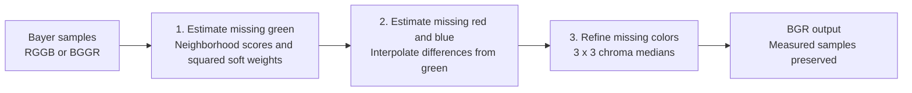
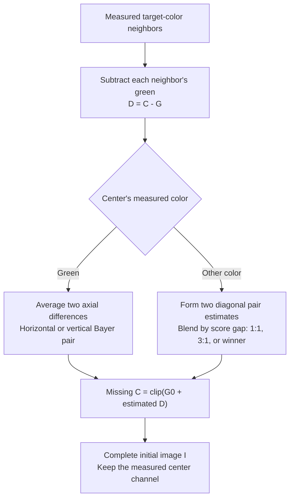
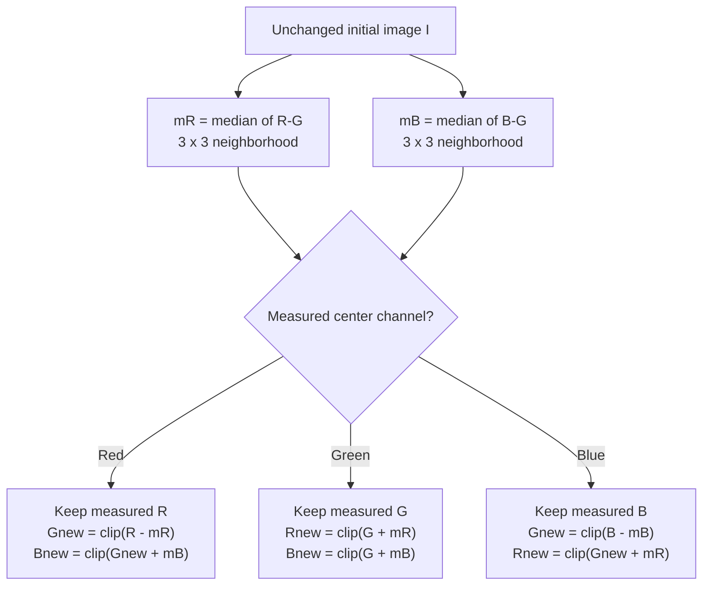

# SoftMenon

Fast 8-bit Bayer demosaicing on CPU and CUDA, with C/C++ and Rust interfaces.
Supports **RGGB and BGGR → BGR**, including odd image sizes and strided rows.
Forked from [libdebayer](https://github.com/catid/libdebayer); existing library
and API names are retained.

## Algorithms

- **Bilinear** — simple local interpolation.
- **Malvar 2004** — fixed cross-channel correction filters.
- **Menon 2007** — full paper DDFAPD, including refinement.
- **SoftMenon** — neighborhood directional scores and squared soft green weights,
  followed by a 3×3 chroma-median refinement that preserves every measured sample.

SoftMenon scores **37.946 dB**, **1.017 dB above full paper Menon**, on our
442-image benchmark. These are average results; individual scenes can favor
another method. [benchmarks.md](benchmarks.md) reports the evaluation protocol,
quality comparisons, raw results, and reproduction instructions.

## How SoftMenon works

Each Bayer pixel measures just one of red, green, or blue. SoftMenon fills the
two missing channels in three stages. The diagrams use logical RGB names;
the library writes interleaved **BGR**. Full paper Menon remains a separate
algorithm and benchmark baseline.



**1. Soft directional green.** At each measured red or blue pixel, estimate
green horizontally and vertically. Each estimate averages the two adjacent
green samples and adds a correction from the measured center color and its
same-color neighbors two pixels away. Let `C0` be the measured red or blue
center value; `GL, GR, GU, GD` are measured green one pixel left, right, up,
and down. `CL2, CR2, CU2, CD2` are samples of the center's color two pixels
away in those directions.

```text
Gh = round((GL + GR)/2) + round(3*(2*C0 - CL2 - CR2)/16)
Gv = round((GU + GD)/2) + round(3*(2*C0 - CU2 - CD2)/16)
```

Each `round` means nearest integer, with half ties toward positive infinity.
The two terms in each estimate are rounded separately; `Gh` and `Gv` are not
clipped yet. The correction uses three-quarters of the Hamilton–Adams strength.
Use these same estimates, including that correction strength, at neighboring
measured red/blue sites, and form the color differences **at those same sites**:

```text
Dh(q) = C(q) - Gh(q)
Dv(q) = C(q) - Gv(q)
```

A direction scores well when its color differences vary little along that
direction, both on the center line and nearby parallel lines. For horizontal
interpolation, compare the `Dh` values joined below. Each line segment contributes
its labeled weight times the absolute difference between its endpoints:

```text
                 x=-2    -1      0      +1     +2

y=-2               o------1------o------1------o
y=-1                       o------1------o
y= 0               o------3-----[p]-----3------o
y=+1                       o------1------o
y=+2               o------1------o------1------o

Each o is a measured red/blue site carrying Dh.
Every segment joins sites of the same measured color.
For the vertical score, transpose the stencil and use Dv.
```

Define the horizontal and vertical consistency at a site `q` as follows.
Coordinates are `(x,y)` offsets:

```text
Lh(q) = abs(Dh(q) - Dh(q + (-2,0))) + abs(Dh(q) - Dh(q + (2,0)))
Lv(q) = abs(Dv(q) - Dv(q + (0,-2))) + abs(Dv(q) - Dv(q + (0,2)))

Sh = 3*Lh(p) + Lh(p + (0,-2)) + Lh(p + (0,2))
   + abs(Dh(p + (-1,-1)) - Dh(p + (1,-1)))
   + abs(Dh(p + (-1, 1)) - Dh(p + (1, 1)))

Sv = 3*Lv(p) + Lv(p + (-2,0)) + Lv(p + (2,0))
   + abs(Dv(p + (-1,-1)) - Dv(p + (-1,1)))
   + abs(Dv(p + ( 1,-1)) - Dv(p + ( 1,1)))
```

The score reaches two pixels from the center in color-difference space.
Computing those differences needs RAW samples up to four pixels away. Stabilize
the scores by adding one, square them, and give each green estimate the weight
from the opposite direction:

```text
Wh = (Sv + 1)^2
Wv = (Sh + 1)^2
G  = clip(round((Wh*Gh + Wv*Gv) / (Wh + Wv)))
```

A lower horizontal score therefore favors `Gh`; a lower vertical score favors
`Gv`. Squaring strengthens that preference while retaining a soft blend.
`clip` limits the result to `[0,255]`. Measured green passes through unchanged.
RAW neighbors beyond the image use phase-preserving reflect-101 reflection.

These directional estimates adapt [Hamilton–Adams](https://patents.google.com/patent/US5629734A/en),
and the neighborhood consistency stencil follows [Menon, Andriani and Calvagno (2007)](https://doi.org/10.1109/TIP.2006.884928).
SoftMenon uses the squared soft weighting above, followed by the two stages below.

**2. Initial color reconstruction.** With green available at every pixel,
estimate missing red and blue through their differences from green. For a
target color `C` (red or blue), each measured-color neighbor contributes
`D = C - G`, using the green estimate at that same neighbor. Interpolate `D`,
then add the center green `G0`:



At a **measured-green pixel**, red neighbors lie along one axis and blue
neighbors along the other. For this Bayer position:

```text
          B_up
 R_left  [G0]  R_right
         B_down

R = clip(G0 + round(((R_left - G_left) + (R_right - G_right))/2))
B = clip(G0 + round(((B_up   - G_up)   + (B_down  - G_down ))/2))
```

`G_left`, for example, is the green reconstructed at the measured `R_left`
site in stage 1. At the other green position, exchange the red/blue axes.

At a **measured-red pixel**, the four nearest measured blue samples are
diagonal. At a measured-blue pixel, exchange red and blue in this diagram:

```text
 B_NW             B_NE
          [R0]
 B_SW             B_SE

D_NW = B_NW - G_NW        D_NE = B_NE - G_NE
D_SW = B_SW - G_SW        D_SE = B_SE - G_SE

E1 = round((D_NW + D_SE)/2)    S1 = abs(D_NW - D_SE)
E2 = round((D_NE + D_SW)/2)    S2 = abs(D_NE - D_SW)

gap = abs(S1 - S2)
winner = E1 if S1 <= S2, else E2
loser  = E2 if S1 <= S2, else E1

If gap <= 16:       D_est = round((E1 + E2)/2)
Else if gap <= 64:  D_est = round((3*winner + loser)/4)
Otherwise:         D_est = winner

B = clip(G0 + D_est)
```

The score gap controls how strongly to favor the more consistent diagonal:
equal weights for a gap up to 16 DN, three-to-one weights up to 64 DN, then
the winner alone. Both pair estimates are rounded before blending;
measured red `R0` stays exact.
All missing red/blue values are clipped to `[0,255]`, producing the complete
initial image `I` used by the next stage.

**3. Median refinement.** In a 3×3 neighborhood, take the median of the nine
`R-G` differences and, separately, the nine `B-G` differences. These medians
can suppress isolated false-color estimates. Use the measured center channel
to anchor the reconstruction:



`clip` limits values to `[0,255]`; green is clipped **before** reconstructing
the other missing color. Both medians read the same unchanged image, so an
updated pixel never affects its neighbors during this pass. Neighborhoods at
the image edge use reflect-101 reflection.

Median filtering of color differences is a classical artifact-suppression idea;
see [Freeman's color-reconstruction patent](https://patents.google.com/patent/US4774565A/en).
SoftMenon uses the same chroma medians to refine missing green and red/blue
in a single cleanup pass. Every measured Bayer sample remains exact.
The local color-difference assumption can still fail
on fine patterns or sharp color boundaries; see the quality results and
exact refinement equations in [benchmarks.md](benchmarks.md#softmenon-refinement).

The implementation is in [the initial CPU stages](cpu/cpu_kernel.cpp),
[CPU median refinement](cpu/chroma_median.hpp), and
[CUDA median refinement](c/src/chroma_median.cuh).

## Measured comparison

442 images, both Bayer phases, full-image all-channel mean PSNR. Library PSNR
uses CUDA outputs; CPU scores agree at the displayed precision. Latency is warm
**1920×1080 host-to-host**, mean of the two phase medians. CPU: eight physical
cores of a Threadripper PRO 9985WX. GPU: RTX PRO 6000 Blackwell Max-Q; transfers
included. FPS is `1000 / mean phase-median milliseconds`. These are workstation
results, not Jetson measurements.

| Method | PSNR dB | CPU ms | CPU FPS | CUDA ms | CUDA FPS |
|---|---:|---:|---:|---:|---:|
| Bilinear | 28.914 | 0.283 | 3,535 | 0.350 | 2,857 |
| Malvar 2004 | 33.963 | 0.643 | 1,556 | 0.350 | 2,857 |
| Menon 2007, full paper | 36.928 | 1.197 | 836 | 0.539 | 1,854 |
| SoftMenon | **37.946** | 0.493 | 2,027 | 0.374 | 2,674 |
| OpenCV bilinear | 28.914 | 0.309 | 3,238 | — | — |
| OpenCV edge-aware | 28.927 | 0.322 | 3,108 | — | — |
| OpenCV VNG, registration corrected | 33.509 | 6.762 | 148 | — | — |
| NPP CFA reconstruction | 29.103 | — | — | 0.407 | 2,455 |

SoftMenon's SIMD green kernels compute estimates only where green is missing.
The CPU caches directional color differences and processes strips through all
three stages while their intermediates fit in cache. Its cleanup reuses two
chroma medians for all missing colors.

The table uses the recorded CPU, CUDA, OpenCV, and NPP runs on the same workstation.
Dataset splits, hashes, decoder rules, baseline validation, timing
scope, external adapter details, validation results, and reproduction commands
are in [benchmarks.md](benchmarks.md). Scores include all three channels.

## Examples

Look closely at the boat's ropes and rigging: the lower-quality reconstructions
show false-color fringes along these fine lines. Open the images at full size
to compare the artifacts.

Kodak `kodim11`, BGGR; individual full-image PSNR:

| Bilinear: 28.761 dB | Malvar: 34.366 dB |
|---|---|
|  |  |
| **Paper Menon: 39.102 dB** | **SoftMenon: 40.006 dB** |
|  |  |

Kodak `kodim19`, BGGR: [paper Menon, 39.918 dB](menon2007.lighthouse.png)
and [SoftMenon, 40.800 dB](softmenon.lighthouse.png).
Images courtesy of Kodak / [Rich Franzen's collection](https://r0k.us/graphics/kodak/).

## Build and use

CPU build and regression tests:

```bash
cmake -S cpu -B build/cpu -DCMAKE_BUILD_TYPE=Release -DDEBAYER_CPU_BUILD_DEMO=OFF
cmake --build build/cpu -j
ctest --test-dir build/cpu --output-on-failure
```

Use `SARONIC_DEBAYER_SOFTMENON` in the CPU or CUDA C++ wrapper. The CPU wrapper
supports `Debayer(8)` to select eight workers, including the calling thread.
See [CPU usage](cpu/README.md).

The [CUDA C API](c/include/debayer.h) accepts device buffers. Its workspace
entry points avoid per-frame allocation. Device buffers require a four-pixel
halo on every side; use `SARONIC_DEBAYER_PAD` for allocation and origins.
The [C++ wrapper](cpp/include/debayer_cpp.h)
manages transfers and reusable scratch. The [Rust API](rust/src/lib.rs) exposes
`SoftMenonRggb2Bgr` and `SoftMenonBggr2Bgr`. Menon entry points implement
the complete paper baseline.

`nix develop` provides the build environment. For dataset download
and standalone CPU/CUDA benchmark builds, follow [benchmarks.md](benchmarks.md).
